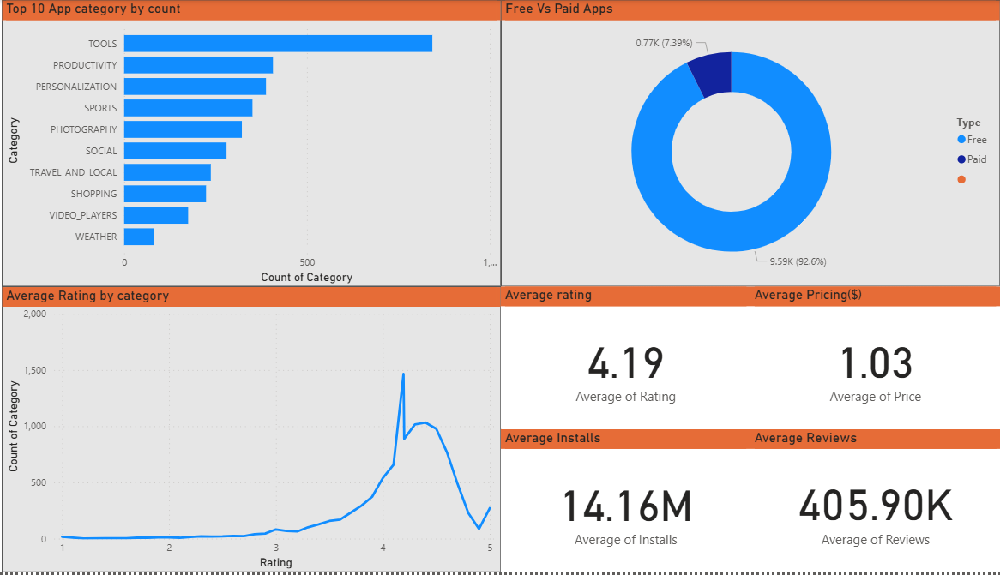

# 📱 Play Store Data Analysis Project

### 👨‍💻 By Aditya Kumar Singh

---

## 🧠 Overview
This project explores and analyzes the **Google Play Store dataset** to uncover insights about app categories, user ratings, and pricing strategies.  
It involves **data cleaning, exploratory data analysis (EDA)**, and **visualization using Power BI**.

---

## 🧰 Tools and Libraries Used
- **Python** – for data cleaning and EDA  
  (Pandas, NumPy, Matplotlib, Seaborn)
- **Google Colab** – to execute the notebook online  
- **Power BI** – to create interactive visual dashboards  
- **GitHub** – for version control and project hosting  

---

## 📂 Data Source
The dataset used in this project was collected from **Kaggle**:  
📊 [Google Play Store Apps Dataset](https://www.kaggle.com/datasets/lava18/google-play-store-apps?resource=download)

This dataset contains detailed information about Android applications available on the Google Play Store, including app category, rating, size, installs, price, and more.

---

## 🧹 Data Cleaning
- Removed missing and duplicate values  
- Standardized column names  
- Converted data types for consistency  
- Cleaned `Installs`, `Size`, and `Price` columns  
- Handled outliers and inconsistent ratings  

---

## 📊 Exploratory Data Analysis (EDA)
Key analysis performed in the notebook:
- Top app categories and their average ratings  
- Relationship between installs, reviews, and ratings  
- Distribution of app sizes and prices  
- Comparison between free and paid apps  
- Correlation between different numerical features  

---

## 📈 Power BI Dashboard
A **fully interactive Power BI dashboard** visualizes:
- App category performance  
- Ratings distribution  
- Free vs Paid app comparison  
- Review count and installs overview  

🖼️ **Dashboard Preview:**



> Open the `.pbix` file in Power BI Desktop to explore the dashboard interactively.

---

## 🌐 View Notebook Online
You can view or run the Colab notebook directly using this badge:  

[](https://colab.research.google.com/github/Adityaxletscode
/playstore-data-analysis/blob/main/notebooks/PlayStore_dataAnalysis.ipynb)

---

## 🧾 Key Insights
- Free apps dominate the store, but paid apps generally have higher average ratings.  
- **Family**, **Game**, and **Tools** categories are the most popular.  
- Apps with frequent updates receive better reviews and ratings.  
- Pricing doesn’t always correlate with higher ratings.  

---

## ⚙️ How to Run Locally
1. Clone the repository  
   ```bash
   git clone https://github.com/Adityaxletscode/playstore-data-analysis.git
